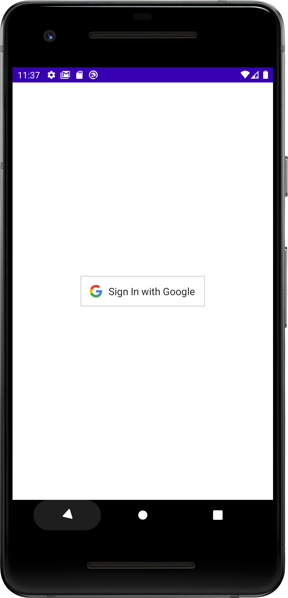
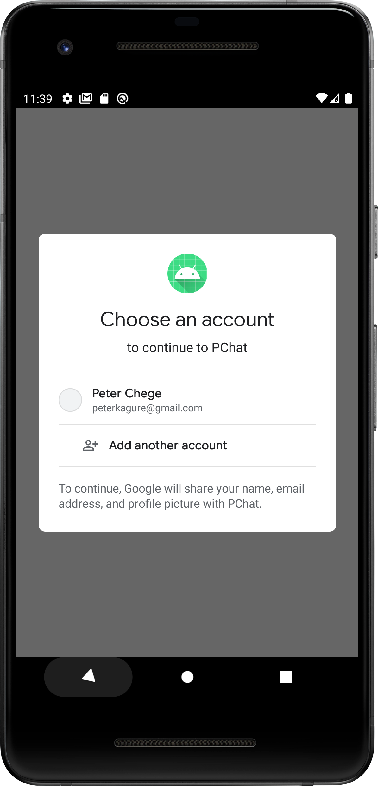
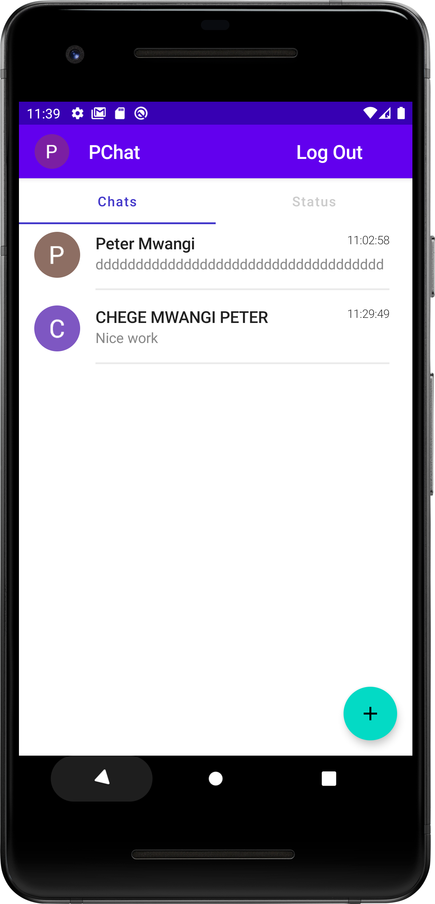
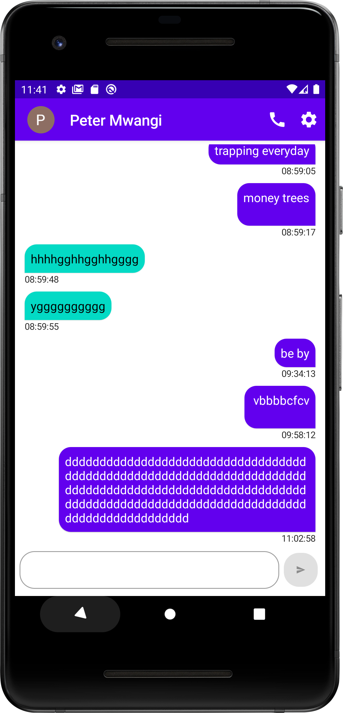
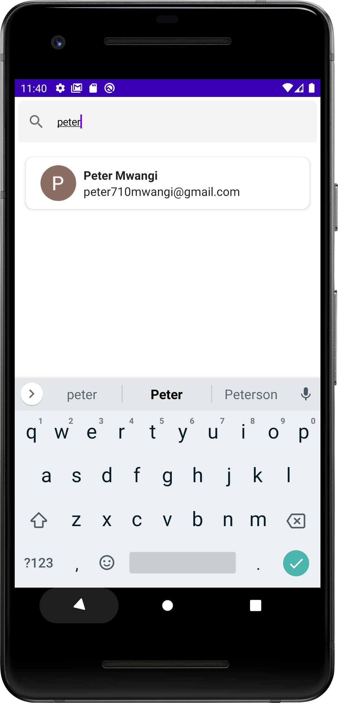

# Android Chat Application (One-to-one)

This is a native chat android application built with jetpack compose (Modern Android UI library).
Features include private chat messaging with real time updates using socket.io 

NB: If you run the application it wont work because the server is not available 
[Github Link To Server Application](https://github.com/chege4179/PChatAPI)

## Screenshots of the app
  

  

## Technologies Used in the Android App
1. Jetpack Compose
2. Dagger Hilt for Dependency Injection
3. Retrofit to make API Calls for fetching individual messages
4. Some of the google accompanist libraries for extra features
5. MVVM architecture
6. Socket.io for real time communication between the app and the server
7. Passwordless Google sign in using your email

## Backend Application
The backend application is built on node.js with the express.js framework to store and retrieve
information of the application.The database used is Mongo DB

NB: The server application is not deployed because the free deployment platforms don't support
server deployment for websockets application and even so when deployed the connection will be killed
after the maximum execution time is reached

## Technologies Used in the Backend Application(Server)
1. Express.js
2. Socket.io for real time communication
3. Mongoose for connecting with mongo DB

## Features to come
1. Hopefully a status feature like WhatsApp

